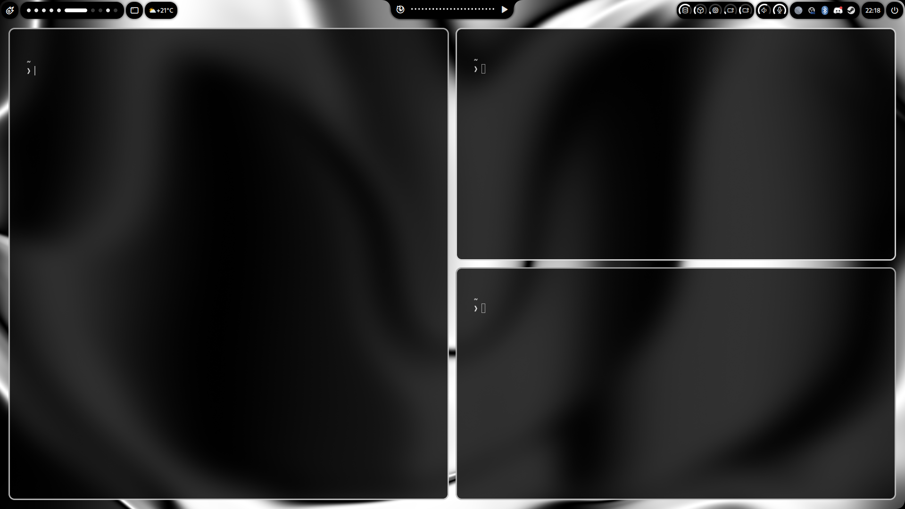

# Hyprland / Hyprdots dotfiles



## Dependencies
```
sudo pacman -S hyprland kitty mpv stow
```
### Ax-Shell
https://github.com/Axenide/Ax-Shell

### Vibe
https://github.com/TornaxO7/vibe

## Installation
```
$ git clone https://github.com/m-ahiru/dotfiles.git
$ cd dotfiles
$ stow .
```
